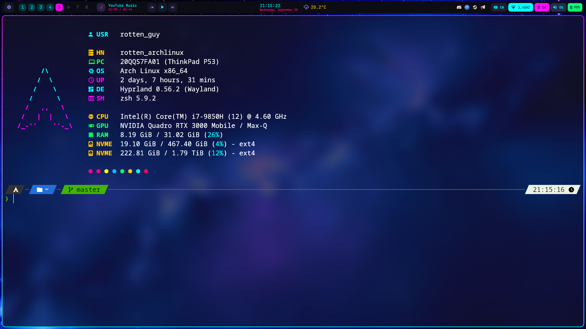
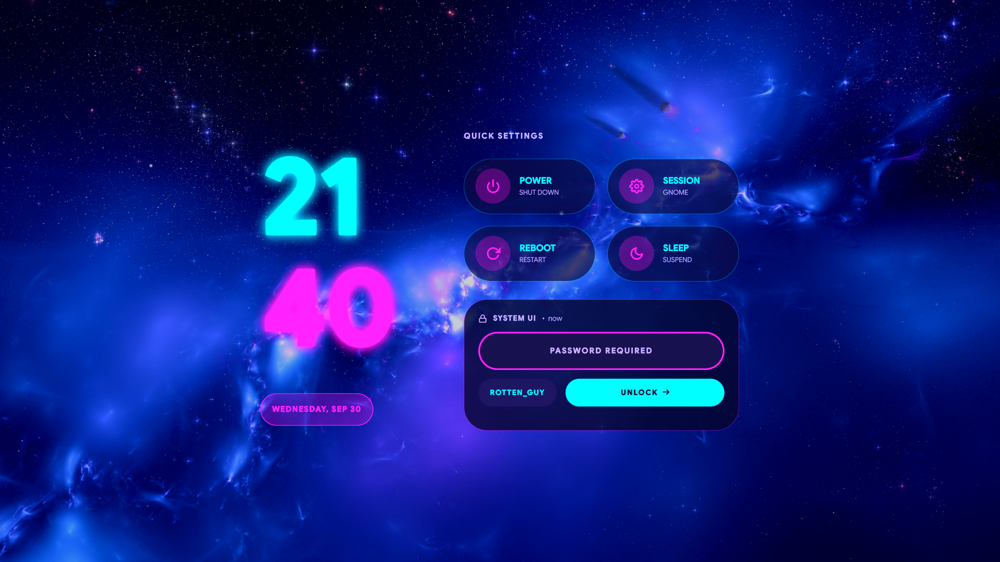
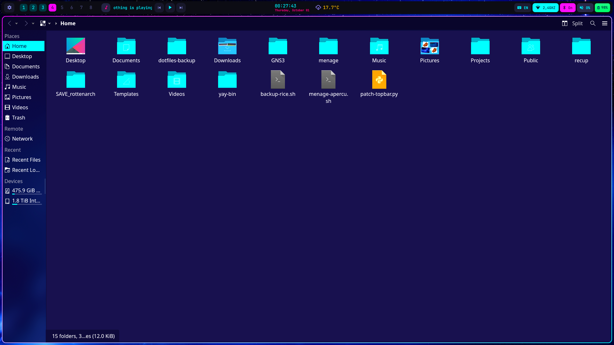
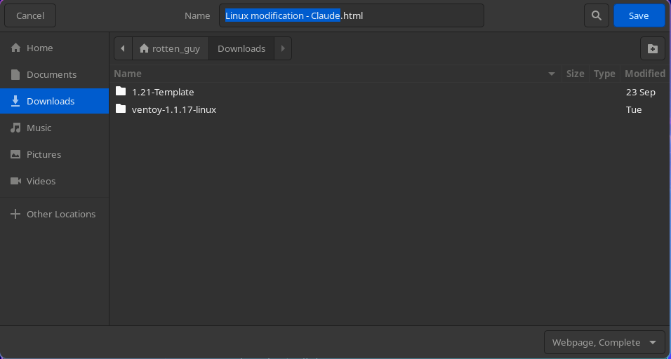

<div align="center">

# 🌌 rotten_dotfiles

**A neon cyan / magenta Hyprland rice, set against a nebula.**

*Arch Linux · Hyprland 0.56 (Lua config) · Serpantinum · ThinkPad P53*

</div>

---

## ✨ Features

| | Component | Details |
|---|---|---|
| 🔐 | **`nebula` SDDM greeter** | Custom cyan / magenta theme on a nebula wallpaper, neon clock with a glow, login with **password or fingerprint** |
| 🌈 | **Animated borders** | Cyan → magenta gradient that rotates continuously at a constant speed, with a smooth fade when focus changes |
| 🎯 | **Chroma S cursor** | Precision crosshair with an animated RGB outline (*Chroma Cursors S* pack by Glimy, converted from Windows), smoothed animation |
| 🎨 | **"NVIDIA-style" colors** | Screen shader replicating the NVIDIA Control Panel: brightness 60 / contrast 65 / digital vibrance 85 |
| 🗂️ | **Dolphin "Nebula"** | Kvantum + KDE color scheme: translucent night-blue windows blurred by Hyprland, white text, cyan selection |
| 🌙 | **Dark GTK dialogs** | "Save as" / "Open" windows in dark mode, Papirus icons with cyan folders |
| 📂 | **Colorful `ls`** | `eza` with a Nebula theme: one color per file type, icons, git status |
| 📝 | **LazyVim** | Neovim with LazyVim, launchable from the app launcher (opens in kitty) |
| ⚡ | **Instant workspaces** | `SUPER + 1…0` bound directly to Hyprland's dispatchers, no latency; `SUPER + Tab` / `SUPER + Shift + Tab` for next / previous workspace |
| 📐 | **Fixed top bar** | When the `SUPER + E` panel opens, the bar re-centers its clock and docks its indicators against the panel |
| 🖥️ | **Terminal** | kitty (with `Ctrl + = / - / 0` zoom) + zsh + starship + a custom fastfetch + a Nebula-colored nano |
| ✂️ | **Editor-like shell** | `Shift / Ctrl + Shift + ←→` to select, `Ctrl + A` to select the whole command, typing replaces the selection; `clear` and `Ctrl + L` do a real reset (scrollback saved locally first) |
| 😴 | **Reliable sleep** | NVIDIA suspend services enabled; no automatic screen-off or sleep, closing the lid still suspends |
| 🎮 | **Gaming** | Steam with Proton Experimental for every title |
| 🎧 | **Bluetooth** | Saved pairings (Sony WH-1000XM4 headphones, Lily58 split keyboard) |

---

## 🖼️ Preview

### Terminal & top bar



kitty with zsh, a starship prompt and a custom fastfetch, under Serpantinum's top bar (workspaces, media player, clock, weather, Wi-Fi, Bluetooth, battery).

### Greeter



The `nebula` SDDM theme: neon clock (cyan hours, magenta minutes, with a glow), dark translucent cards over the nebula wallpaper, and quick power / session actions. Log in by typing your password, **or** leave the field empty, press Enter, then touch the fingerprint reader.

### File manager



Dolphin with the **Nebula** Kvantum theme and KDE color scheme: the window is slightly translucent so Hyprland blurs the wallpaper behind it, with white text, cyan folders and a cyan selection.

### Save / Open dialogs



The GTK file dialog (used by Brave and other apps through the desktop portal), forced to dark mode, with Papirus icons.

### Not pictured (it moves!)

- **Window borders**: a thin cyan → magenta gradient slowly spins around the focused window (one full turn every ~10 s, linear speed so it never jerks), and fades smoothly to grey when the window loses focus.
- **Cursor**: a small black precision crosshair whose outline cycles through RGB colors in a smooth loop (~2.3 s per cycle). Every other cursor state (link, text, busy, resize…) comes from the same Chroma pack and is animated too.
- **Colors**: the screen shader makes everything more vivid, like NVIDIA's *Digital Vibrance* on Windows, without burning already-saturated colors.

---

## 📁 Repository layout

```
dotfiles/
├── README.md
├── assets/                     # README screenshots
├── scripts/                    # helper scripts (see below)
├── home/                       # everything that goes into ~
│   ├── .config/hypr/           # Hyprland: Lua config, keybinds, borders, env, shader
│   ├── .config/kitty/          # terminal + zoom shortcuts
│   ├── .config/fastfetch/      # perso.jsonc = the real config
│   ├── .config/eza/            # ls colors
│   ├── .config/nvim/           # LazyVim
│   ├── .config/nano/           # nano colors
│   ├── .config/Kvantum/        # Nebula Qt theme (Dolphin)
│   ├── .config/qt6ct/
│   ├── .config/kdeglobals      # KDE colors used by Dolphin
│   ├── .config/dolphinrc
│   ├── .config/gtk-3.0/ .config/gtk-4.0/
│   ├── .config/environment.d/  # GTK_THEME for systemd services (portal)
│   ├── .config/starship.toml
│   ├── .config/serpantinum/settings.json  # bar, theme, idle (location removed)
│   ├── .local/share/color-schemes/   # Nebula KDE color scheme
│   ├── .local/share/applications/    # launcher entries (Neovim in kitty)
│   ├── .local/share/icons/ChromaS/
│   ├── .local/share/serpantinum/
│   ├── .zshrc
│   └── Pictures/Wallpapers/
├── system/                     # system files (copy with care)
│   ├── etc/pam.d/sddm          # password first, then fingerprint
│   ├── etc/pam.d/sudo          # fingerprint for sudo
│   ├── etc/sddm.conf.d/        # enables the nebula theme
│   ├── usr/share/sddm/themes/nebula/
│   └── var/lib/bluetooth/      # pairings (only valid on this machine)
├── packages/
│   ├── pacman.txt              # installed official packages
│   ├── aur.txt                 # installed AUR packages
│   ├── services-system.txt     # enabled system services
│   ├── services-user.txt       # enabled user services
│   └── gsettings-interface.txt # GTK settings (theme, icons, cursor)
├── feuille-de-route-rice.md   # full history of the rice (in French)
└── LAST_BACKUP.txt
```

### Scripts

| Script | Purpose |
|---|---|
| `backup-rice.sh` | Copies everything above into the repo, then commits and pushes |
| `nebula-kvantum.sh` | Builds the Nebula Kvantum theme from KvArcDark and enables it |
| `nebula-colors.sh` | Creates the Nebula KDE color scheme and applies it to Dolphin |
| `patch-topbar.py` | Patches Serpantinum's top bar for the `SUPER + E` panel (`--restore` to undo) |
| `menage-apercu.sh` | Dry run used to remove KDE Plasma / GNOME while protecting useful packages |

---

## 📦 Requirements

For a fresh install of Arch Linux or an Arch-based distro (CachyOS, …).

### Required

| Package | Purpose |
|---|---|
| `hyprland` (≥ 0.56) | Compositor. **The config is written in Lua**: older versions won't read it |
| Serpantinum | Top bar, menus, notifications, matugen (see its own repository for installation) |
| `hyprpolkitagent` | Password prompt for admin actions |
| `kitty` | Terminal |
| `zsh` · `starship` · `fastfetch` · `eza` | Shell, prompt, system info, colorful `ls` |
| `zsh-autosuggestions` · `zsh-syntax-highlighting` | zsh plugins |
| `sddm` · `qt6-5compat` | Display manager + graphical effects used by the `nebula` theme |
| `pipewire` · `pipewire-pulse` · `wireplumber` | Audio (Bluetooth included) |
| `bluez` · `bluez-utils` · `networkmanager` · `upower` · `power-profiles-daemon` | Bluetooth, network, battery and power modes used by Serpantinum |
| `dolphin` · `kvantum` · `qt6ct` · `breeze-icons` · `kio-extras` | File manager and its theme |
| `ffmpegthumbs` · `kdegraphics-thumbnailers` · `archlinux-xdg-menu` | Dolphin thumbnails and "Open with" menu outside Plasma |
| `papirus-icon-theme` · `papirus-folders` *(AUR)* | GTK icons with cyan folders |
| `grim` · `slurp` · `zbar` · `wl-clipboard` · `playerctl` | Screenshots (`zbar` is required by Serpantinum's screenshot tool), clipboard, media controls |
| `ttf-jetbrains-mono-nerd` · `noto-fonts-emoji` | Terminal font, icons and emojis |
| `git` · `openssh` · `less` | Clone and update this repository (`less` is needed by `git log` and `man`) |

### Optional

| Package | Purpose |
|---|---|
| `neovim` · `ripgrep` · `fd` · `fzf` · `lazygit` · `gcc` · `make` | LazyVim and its tools |
| `fprintd` | Fingerprint login and `sudo` |
| `hyprshade` *(AUR)* | Toggle the color shader on the fly |
| `ddcutil` · `imagemagick` · `libqalculate` | External monitor brightness, wallpaper thumbnails, launcher calculator (used by Serpantinum scripts) |
| `cava` | Audio visualizer |
| `steam` · `lib32-nvidia-utils` · `lib32-vulkan-icd-loader` | Gaming (needs the `multilib` repo) |
| `protontricks` · `protonup-qt` *(AUR)* | Windows components for a game's Proton prefix, community Proton builds (GE-Proton) |
| `nvidia` · `nvidia-utils` | Drivers for NVIDIA GPUs |

```bash
sudo pacman -S --needed hyprland hyprpolkitagent kitty zsh starship fastfetch eza \
  zsh-autosuggestions zsh-syntax-highlighting sddm qt6-5compat \
  pipewire pipewire-pulse wireplumber bluez bluez-utils networkmanager upower power-profiles-daemon \
  dolphin kvantum qt6ct breeze-icons kio-extras ffmpegthumbs kdegraphics-thumbnailers archlinux-xdg-menu \
  papirus-icon-theme grim slurp zbar wl-clipboard playerctl \
  ttf-jetbrains-mono-nerd noto-fonts-emoji git openssh less \
  neovim ripgrep fd fzf lazygit gcc make fprintd ddcutil imagemagick libqalculate cava
yay -S papirus-folders hyprshade
```

> 💡 `packages/pacman.txt` and `packages/aur.txt` list everything that was installed. Use them as a reference, not as a list to install in one go.

---

## 🚀 Installing on a fresh system

### 1. Clone the repository

```bash
git clone git@github.com:PoUrRiTuRe/dotfiles.git ~/dotfiles-backup
cd ~/dotfiles-backup
```

### 2. User config

Install **Serpantinum cleanly first**, then copy the config on top:

```bash
cp -a home/.config/. ~/.config/
cp -a home/.local/share/icons home/.local/share/color-schemes home/.local/share/applications ~/.local/share/
cp -a home/.zshrc ~/
mkdir -p ~/Pictures && cp -a home/Pictures/Wallpapers ~/Pictures/
chsh -s /usr/bin/zsh      # if zsh isn't the default shell (CachyOS uses fish)
```

> ⚠️ Don't copy `home/.local/share/serpantinum` over a newer version of Serpantinum. Reapply the tweaks instead (see [Tweaks](#-tweaks)).

### 3. GTK: dark mode, icons, cursor

These settings live in GNOME's settings database, not in files, so they must be set once:

```bash
gsettings set org.gnome.desktop.interface gtk-theme 'Adwaita-dark'
gsettings set org.gnome.desktop.interface color-scheme 'prefer-dark'
gsettings set org.gnome.desktop.interface icon-theme 'Papirus-Dark'
gsettings set org.gnome.desktop.interface cursor-theme 'ChromaS'
gsettings set org.gnome.desktop.interface cursor-size 32
papirus-folders -C cyan --theme Papirus-Dark
```

### 4. Top bar fix

```bash
python3 scripts/patch-topbar.py
```

### 5. `nebula` SDDM greeter

```bash
sudo cp -a system/usr/share/sddm/themes/nebula /usr/share/sddm/themes/
sudo cp -a system/etc/sddm.conf.d /etc/
sudo systemctl enable sddm
```

### 6. Fingerprint *(optional)*

Don't replace the new distro's PAM files: **add** these two lines at the very top of the `auth` section of `/etc/pam.d/sddm`:

```
auth  [success=1 new_authtok_reqd=1 default=ignore]  pam_unix.so  try_first_pass likeauth nullok
auth  sufficient  pam_fprintd.so
```

Then enroll your finger with `fprintd-enroll`. At the greeter: password + Enter, **or** empty field + Enter, then your finger.

### 7. Bluetooth *(same machine only)*

```bash
sudo systemctl stop bluetooth
sudo cp -a system/var/lib/bluetooth/. /var/lib/bluetooth/
sudo systemctl enable --now bluetooth
```

### 8. Services

```bash
# NVIDIA: required for a working wake-up from sleep (otherwise the screen freezes)
sudo systemctl enable nvidia-suspend.service nvidia-resume.service nvidia-hibernate.service
# Password prompt for admin actions
systemctl --user enable hyprpolkitagent.service
```

`packages/services-system.txt` and `packages/services-user.txt` list every service that was enabled, for reference.

### 9. Serpantinum settings

`home/.config/serpantinum/settings.json` holds the bar layout, theme and idle settings (screen-off and sleep disabled). It is saved **without** the location used for the weather: Serpantinum will detect it again.

### 10. Reboot 🎉

---

## 🔧 Tweaks

The changes that make this rice, to reapply if you switch shells or versions:

- **Latency-free workspaces**: in `keybinds.lua`, use `hl.dsp.focus({ workspace = i })` instead of `serpantinum msg workspace`. Next / previous: `hl.dsp.focus({ workspace = "e+1" })` and `"e-1"` (open workspaces only, wrapping around; plain `"+1"` keeps creating new empty workspaces).
- **Bluetooth keyboards**: Serpantinum's Bluetooth menu doesn't show the pairing code, so the keyboard keeps disconnecting. Pair from a terminal instead: `bluetoothctl`, then `agent KeyboardDisplay`, `default-agent`, `scan on`, `pair <MAC>`, type the 6-digit passkey **on the Bluetooth keyboard** + Enter, then `trust <MAC>` and `connect <MAC>`.
- **Borders**: `border` (`smooth` curve) and `borderangle` (`linear` curve, `style = "loop"`) animations in `settings.lua`.
- **Colors**: `screen_shader` in `settings.lua` → `~/.config/hypr/shaders/nvidia-like.glsl`. The three values sit at the top of the file; run `hyprctl reload` after editing it.
- **Cursor**: `XCURSOR_THEME=ChromaS` and `XCURSOR_SIZE=32` in `env.lua`.
- **Qt apps (Dolphin)**: `QT_QPA_PLATFORMTHEME=qt6ct` **and** `QT_STYLE_OVERRIDE=kvantum` in `env.lua`. Without the second one, KDE apps force the light Breeze style outside Plasma.
- **GTK dialogs**: `GTK_THEME=Adwaita:dark` in `env.lua` **and** in `~/.config/environment.d/gtk.conf`, because the dialog is drawn by the desktop portal, a systemd service that doesn't see Hyprland's variables. Restart it after changes: `systemctl --user restart xdg-desktop-portal-gtk xdg-desktop-portal`.
- **Top bar**: Serpantinum's `bar/TopBar.qml` packs everything to the left when the `SUPER + E` panel opens; `scripts/patch-topbar.py` fixes it. Re-run it after a Serpantinum update.
- **Sleep on NVIDIA**: the driver keeps video memory across sleep (`PreserveVideoMemoryAllocations=1`), which **requires** the `nvidia-suspend` / `nvidia-resume` / `nvidia-hibernate` services. Without them, the screen freezes on wake-up.
- **Idle**: in Serpantinum's `settings.json`, `idle.actions.dpms` and `idle.actions.suspend` are disabled (dim and lock stay on).
- **zsh selection**: custom ZLE widgets defined **before** the plugins; kitty's `Ctrl + Shift + ←/→` (tab switching) is set to `no_op` so zsh receives it. Unknown keys print `~`: bind them with `bindkey` (e.g. `'^[[3~'` for Delete).
- **Terminal apps in the launcher**: Quickshell ignores `Terminal=true`, so `~/.local/share/applications/nvim.desktop` launches `kitty nvim %F` instead.
- **fastfetch**: matugen overwrites `config.jsonc`, so the real config is `perso.jsonc`, launched from `.zshrc` with `fastfetch --config`.
- **kitty**: `fullscreen_state = "0 0"` window rule, a workaround for the kitty bug that opens it maximized ([kitty#10442](https://github.com/kovidgoyal/kitty/issues/10442)). Remove it once the bug is fixed.

---

## 🗺️ History

Everything that was done, why, and what was set aside: see [`feuille-de-route-rice.md`](feuille-de-route-rice.md) (in French).

---

## 🙏 Credits

- [Hyprland](https://hyprland.org) · Serpantinum · [LazyVim](https://www.lazyvim.org) · [eza](https://github.com/eza-community/eza) · [Kvantum](https://github.com/tsujan/Kvantum) · [Papirus](https://github.com/PapirusDevelopmentTeam/papirus-icon-theme)
- **Chroma Cursors S** cursors by **Glimy**, converted to the Linux format for personal use. Check the pack's license before making this repository public.
- `nebula` SDDM theme: modified from the `material-you` theme shipped with Serpantinum.
- Built with the help of **[Claude](https://claude.ai)** (Anthropic): most of this setup was configured, debugged and documented together with Claude, from the greeter theme to the backup script.
